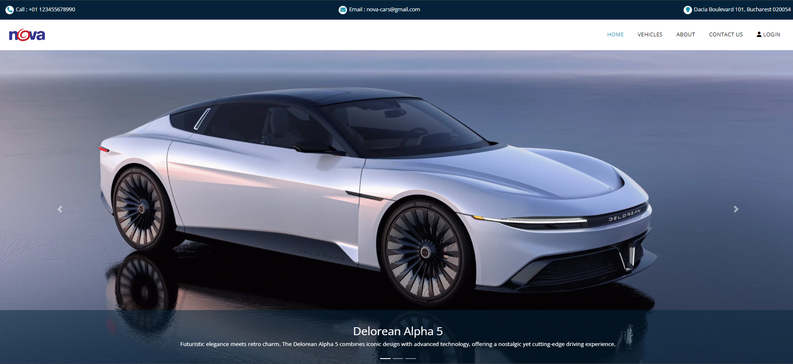

# Nova App



Nova App is a concept website designed to showcase futuristic-looking cars, developed in collaboration with Nova Cars, an imaginary company.

This project was built using Node.js, Handlebars, Express, and MySQL for user registration and login functionality. It has been deployed using Heroku and is accessible at [Nova App on Heroku](https://tbtiberiu-nova-app-8339ae54e906.herokuapp.com/) (Not Avaliable anymore because of the hosting costs).

## Features

- **Futuristic Car Showcase**: Display a collection of concept cars with sleek, modern designs.
- **User Authentication**: Users can register, log in, and manage their profiles.
- **Dynamic Content**: Content is dynamically generated using Handlebars templates.
- **Database Integration**: User data is stored in a MySQL database.

## Technologies Used

- **Node.js**: Server-side JavaScript runtime for building scalable network applications.
- **Express**: Web application framework for Node.js, used for building the backend.
- **Handlebars**: Templating engine for rendering dynamic content.
- **MySQL**: Relational database management system used for storing user data.
- **Heroku**: Cloud platform used for deploying the application.

## Installation

### Prerequisites

- [Node.js](https://nodejs.org/) installed on your machine.
- [MySQL](https://dev.mysql.com/downloads/installer/) installed and running.

### Steps

1. **Clone the repository**:
   ```bash
   git clone https://github.com/tbtiberiu/nova-app.git
   ```
2. **Navigate to the project directory**:
   ```bash
   cd nova-app
   ```
3. **Install dependencies**:
   ```bash
   npm install
   ```
4. **Set up the database**:

   - Install MySQL from the [official website](https://dev.mysql.com/downloads/installer/).
   - Run the MySQL script from `create-db.sql` to set up the necessary database and tables.
   - Set the environment variables related to the database inside `.env`.

5. **Run the application**:
   - You can start the application using Node.js:
     ```bash
     node app.js
     ```
   - Alternatively, you can use Nodemon for automatic restarting:
     ```bash
     nodemon app.js
     ```

## Usage

Once the application is running, you can access it locally via `http://localhost:3000/`.

Your terminal should look like this:

```bash
> nova-app@1.0.0 start
> node app.js

Server running on port 3000
Connected to MySQL database!
```
